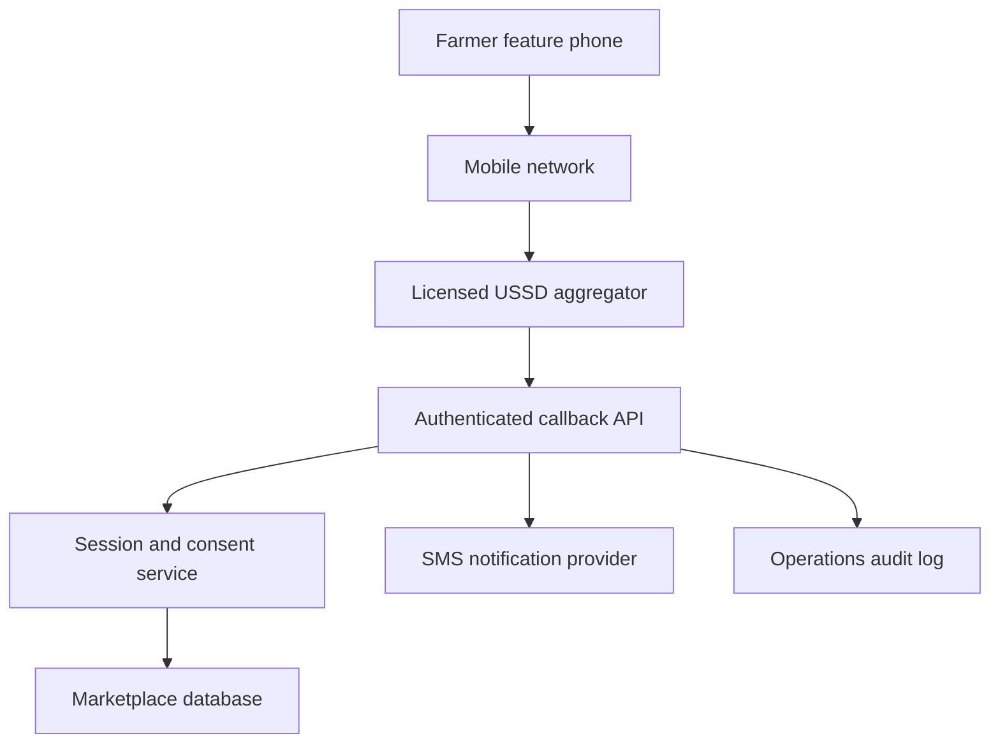

# ShambaNi USSD controlled-pilot architecture

**Status:** Design only — no short code, telecom connection or production backend is active.

## Recommended route

Use a **shared USSD code through a Uganda-licensed telecom/aggregator** for the first controlled pilot. A dedicated code should be considered only after demand and unit economics are evidenced. Uganda Communications Commission currently lists USSD codes in the 200–298 range and requires confirmation from operators that a requested code is technically implementable. Allocation, fees and provider terms must be confirmed directly before use.

The website must never publish a code until ShambaNi holds dated written confirmation that the code and service path are approved for its use.

## Proposed topology

The public React site is not part of the transaction path. It can show the same menu for demonstrations, but production callbacks, secrets and personal data belong only in protected server-side services.

## Minimum callback contract

The aggregator should send a server-to-server HTTPS request containing a provider session identifier, service code, phone number and accumulated menu text. The ShambaNi API should return plain text beginning with the provider's continue/end token. Exact field names, signature method, timeout and retry behaviour must be taken from the selected provider's signed integration specification.

Required controls:

- verify provider signatures or mutually authenticated connections;
- reject replayed, expired and malformed requests;
- store only the minimum session state with a short retention period;
- encrypt phone numbers at rest and mask them in logs;
- rate-limit by provider and session, not just by public IP;
- use idempotency keys before creating or changing an order;
- keep consent, order, delivery and dispute events in an append-only audit trail;
- never request a mobile-money PIN, password or complete national-ID number;
- separate test and production environments and credentials.

## Proposed menu scope

The first pilot menu should be intentionally narrow:

1. choose language;
2. view sample/current produce categories;
3. submit a callback request from an already consented pilot participant;
4. check the status of a manually confirmed request;
5. receive a help number or end the session.

Do not introduce identity-document uploads, payment initiation or automated farmer approval in the first USSD release.

## Acceptance gates

| Gate | Evidence required | Owner |
|---|---|---|
| Regulatory/telecom route | Written UCC/operator/aggregator confirmation and assigned shared/dedicated code | Founder + provider |
| Data protection | PDPO registration where required, data map, lawful-basis record, notices and retention schedule | Founder + counsel/DPO |
| Backend security | Threat model, access controls, secrets management, encryption, backups, restore test and incident plan | Technical lead |
| Provider integration | Signed specification, sandbox results, signature/replay tests and failure-mode results | Technical lead + provider |
| User safety | Four-language content review, explicit consent, help/escalation route and no-PIN warning | Pilot lead |
| Operations | Named support owner, manual fallback, dispute handling and daily reconciliation | Operations lead |
| Launch | End-to-end test on participating networks and written go-live approval | All owners |

## Test evidence to retain

- successful, timed-out, duplicate, invalid and abandoned sessions;
- menu truncation and low-balance/network-error behaviour;
- consent withdrawal and data deletion handling;
- callbacks under peak concurrent load;
- reconciliation between USSD request, human confirmation and order record;
- incident drill, backup restoration and provider outage fallback;
- accessibility and language findings from participating farmers.

## Official references

- Uganda Communications Commission, Short Codes: <https://www.ucc.co.ug/short-codes/>
- Personal Data Protection Office, Registration: <https://pdpo.go.ug/register/>
- Bank of Uganda, financial infrastructure and licensed providers: <https://bou.or.ug/financial_infrastructure_innovation>

Provider and regulatory requirements can change. Reconfirm them before contracting or publication.
